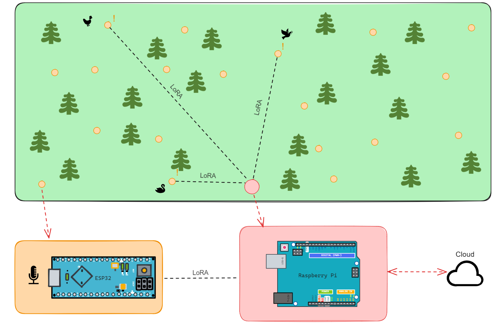

# edge-iot
Edge Computing and the Internet of Things



## Directory Structure

```markdown

./edge-iot
├── .github/
│   └── workflows/
│       └── continuous_integration.yml
├── docs/
│   # Documentation for the project
│   ├── slides/
│   │   └── 00_idea_presentation.pdf
│   ├── reports/
│   │   └── 00_idea_report.pdf
├── src/
│   ├── main.py
├── data/
├── config/
├── tests/
├── bin/
├── lib/
├── Dockerfile
├── .gitignore
├── README.md
```
