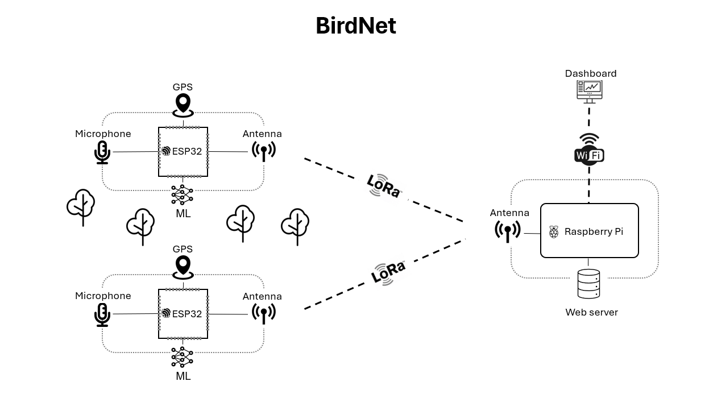

This repository contains an implementation of the system BirdNet, a novel IoT
system for bird monitoring in the wild using Machine Learning. This system 
exploits the proximity of detection nodes to bird sound sources to map the 
detected bird species to  physical locations. As only classification data is 
sent (not audio data), this system offers the additional advantage of data 
privacy. 

__Table of Contents__

- [Hardware](#hardware)
- [Getting Started](#getting-started)

# Hardware

The equipment list used for the implementation of this project are 
listed as follows:

- **ESP32-S3-DevKitC-1 (ESP)**. It will serve as edge nodes to capture data. 
More than one ESP32 may be used (in fact, that is what should happen). For each
ESP32 device, there must be:
    - A LoRa module model **SX1278**. 
    - A microphone module model **TODO**.
    - A GPS module model **TODO**.

- **Raspberry Pi 3 Model B+ (RPI)**. It will be used as the central node of the
architecture. the different ESP32 will periodically send classification 
information to this module. For this central node, there must be:
    - A LoRa module model **SX1278**. 
    - A microSD to store the OS. We have used a MicroSD of 32 GB. 

- **Development device (DEV)**. It will be used to develop, build and flash code 
for this repository. Preferrably, it should use a Linux-based OS, such as 
Ubuntu. 

# Getting Started

Before running the code contained in this repository, the following 
__prerrequisites__ need to be fulfilled. The notation used at the beginning of
each bullet point is shown in [Hardware](#hardware).

- Make sure to have the [Hardware](#hardware) required for this project.

- For ESP and RPI, make sure to have wired the different components. Please 
refer to [docs/wiring.md](docs/wiring.md). If you have made changes to code 
regarding the wiring of some component, wire the physical cables accordingly. 

- For DEV, install the framework 
[ESP-IDF](https://github.com/espressif/esp-idf). The code contained in this 
repository was succesfully built and developed using the version `v5.1.2`. Make 
sure to be able to use `idf.py`. To do so, open a terminal and run the 
following code (if you can see your version of ESP-IDF, then you can use it):
```sh
idf.py --version
``` 

- For DEV, make sure that you can use the tool `idf.py` to flash
one of your ESP32 via USB. A
[Hello World project in ESP-IDF official documentation](https://docs.espressif.com/projects/esp-idf/en/stable/esp32/get-started/windows-setup.html#get-started-windows-first-steps)
may be useful for starters. Read it carefully and remember that the connection
names in your DEV may be different from those listed in the tutorial. 

- For RPI, install the [Raspberry Pi OS](https://www.raspberrypi.com/software/)
and flash it into the microSD card. Make sure you may use `sudo` command, as
it is required for the first package in the following bullet point. 

- For RPI, make sure that SPI is configured appropiately. Further information
may be found [here](https://www.raspberrypi-spy.co.uk/2014/08/enabling-the-spi-interface-on-the-raspberry-pi/).

- For RPI, install the library 
[pigpio](https://abyz.me.uk/rpi/pigpio/), as it will be required to interact 
with LoRa module, and make sure to have installed the library 
[curl for C++](https://raspberry-projects.com/pi/programming-in-c/networking/curl/adding-curl-to-your-project),
as it will be required to connect with backend and dashboard. 

- For DEV and RPI, install the [git utility](https://git-scm.com/downloads). 

Once you have checked that you fulfill all the prerrequisites, follow these
steps to have a functional demo of BirdNet:

1. Clone this repository in both DEV and RPI:

```sh
git clone https://github.com/MarlonMueller/edge-iot.git
```

2. In DEV device, move to the cloned repo directory. Flash the ESP code into
each of your edge nodes by executing the command below. To test whether the
code was correctly flashed into the devices, see the output opbtained in
the terminal. If it has failed, a message error should appear. Otherwise, you
can already visualize the first lines of code. 

```sh
idf.py build flash monitor
```

3. For the RPI, move to the cloned repo directory. A `Makefile` is specifically
designed to automate the compilation of the file for Raspberry Pi. Then,
you just need to execute the generated binary file in `sudo` mode. (Do not
worry, we won't hack your RPI :laughing:). If you forgot to use `sudo` mode, 
after executing the binary file a warning message should appear. 

```sh
make -f Makefile.RPi
sudo ./build/main_rpi
```

4. TODO (WEB)
