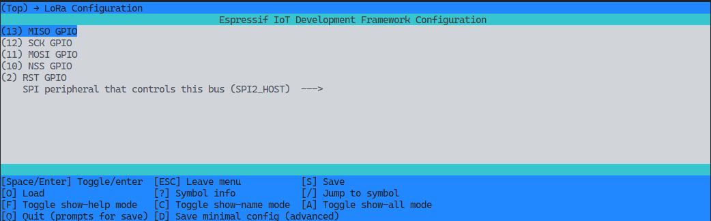

# Wiring

The different components of distributed systems need to be wired together to 
work together and act as an interconnected network. By default, we have standard
wiring, which you are free to modify according to your interests.

In this section we use the names as they appear on the boards for the various 
components connected to each node. For RPI and ESP, the names given by the 
manufacturer are used. You can see a map of their distribution
[here](https://docs.espressif.com/projects/esp-idf/en/latest/esp32s3/hw-reference/esp32s3/user-guide-devkitc-1-v1.0.html#header-block) 
(for ESP) and [here](https://www.raspberrypi.com/documentation/computers/raspberry-pi.html) 
(for RPI).

## Default wiring

For the RPI, the following table maps each connection to the
corresponding pin of the LoRa module SX1278. 

| SX1278 Pin | RPI Pin |
|------------|---------|
| VCC        | 3V3     |
| GND        | Ground  |
| RST        | GPIO22  |
| DIO0       | GPIO27  |
| MOSI       | GPIO10  |
| MISO       | GPIO9   |
| SCK        | GPIO11  |
| NSS        | GPIO8   |

On the other hand, for the ESP several components are required: (i) 
the microphone, (ii) the LoRa module and (iii) the GPS module. 

For the VM3011 microphone, set the following pins.

| VM3011 Pin | ESP Pin |
|------------|---------|
| VCC        | 3V3     |
| GND        | GND     |
| WS         | GPIO42  |
| SCK        | GPIO40  |
| SD         | GPIO1   |
| L/R        | GND     |

For LoRa module, set the following pins.

| SX1278 Pin | ESP Pin |
|------------|---------|
| VCC        | 3V3     |
| GND        | GND     |
| RST        | GPIO2   |
| MOSI       | GPIO11  |
| MISO       | GPIO13  |
| SCK        | GPIO12  |
| NSS        | GPIO10  |

Notice that that the DIO0 pin is not required in this case, unlike in the case
of RPI. 

For GPS module, the following pins are required.

| GPS Pin | ESP Pin |
|---------|---------|
| VCC     | 3V3     |
| RX      | GPIO17  |
| TX      | GPIO18  |
| GND     | GND     |

## Change wiring

> [!CAUTION] 
> Do not change the wiring unless it is strictly necessary. Be specially
> careful with boards pin layouts. There could be some pins that, at
> initialization, are not properly configured and could fry the components.

For RPI, the pins for RST and DIO0 may be changed by assigning the
attributes `modem.eth.resetGpioN` and `modem.eth.dio0GpioN` at [this source file](../src/rpi/main.c). 

On the other hand, for ESP, the wiring of the different pins is managed using
ESP-IDF. Instead of directly changing the variables manually, the best option
is to change them using the corresponding framework. If you have successfully
followed the instructions for [Getting Started in README](../README.md#getting-started),
in the root directory of this repository in a DEV machine, write 
the following command in a terminal with `idf.py` available:

```sh
idf.py menuconfig
```

Then navigate to `LoRa Configuration`. An interface is displayed with 
the corresponding associations between ESP pins and SX1278 pins, as shown
in the following picture.


